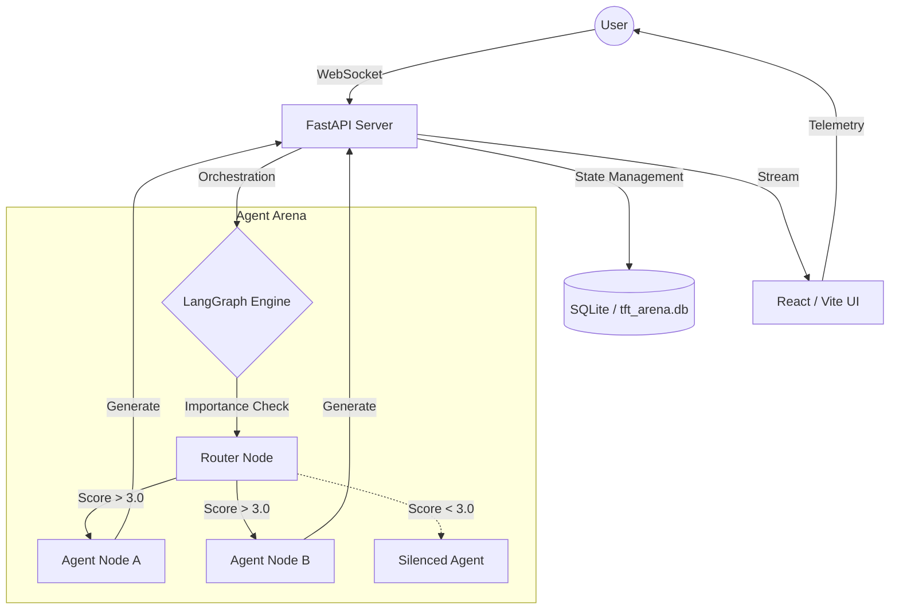

# 🏟️ TFT Arena

**The ultimate multi-agent reasoning bench.** Connect LLMs, orchestrate debates, and synthesize deep insights in real-time.

[](LICENSE)
[](https://reactjs.org/)
[](https://fastapi.tiangolo.com/)
[](https://www.langchain.com/langgraph)

---

## 🚀 Overview

TFT Arena is a sophisticated multi-agent environment designed for complex problem-solving, collaborative brainstorming, and automated synthesis. Unlike standard chat interfaces, TFT Arena uses an **Importance-Based Router** to ensure that only the most relevant agents contribute to the conversation at any given time, preventing "agent noise" and maximizing signal.

### ✨ Key Features

-   **🧠 Intelligent Orchestration**: Powered by LangGraph, our router evaluates every turn to determine which agents are most qualified to respond.
-   **📈 Real-Time Telemetry**: Track agent performance with live Mean & Standard Deviation response times, token budgets, and relevance scores.
-   **📝 Semantic Scratchpad**: A dedicated "whiteboard" agent continuously listens to the conversation, distilling consensus, key ideas, and open questions into a live-updating summary.
-   **🔌 Provider Agnostic**: Native support for OpenAI, Anthropic, Google Gemini, and local models via Ollama.
-   **🛡️ Secure-by-Design**: No more `.env` file management. Configure all API keys and global preferences directly within the secure, database-backed UI settings.

---

## 🏗️ Architecture

The system is built on a modern, event-driven stack designed for low-latency multi-agent interactions.



---

## 📦 Getting Started

### Prerequisites

-   [Docker](https://www.docker.com/) & [Docker Compose](https://docs.docker.com/compose/)
-   (Optional) [Ollama](https://ollama.com/) for local model support

### Quick Start

1.  **Clone the Repository**
    ```bash
    git clone https://github.com/your-username/tft-arena.git
    cd tft-arena
    ```

2.  **Launch the Arena**
    ```bash
    docker compose up --build
    ```

3.  **Access the UI**
    Open [http://localhost:5173](http://localhost:5173) in your browser.

4.  **Configure API Keys**
    Click on **Settings** in the bottom-left corner to securely input your OpenAI, Anthropic, or Gemini keys. These are stored locally in your database and never shared.

---

## 🛠️ Tech Stack

-   **Frontend**: React 18, Vite, TypeSafe Store (Zustand-style), CSS-in-JS.
-   **Backend**: Python 3.11, FastAPI, SQLAlchemy, LangGraph, LiteLLM.
-   **Database**: SQLite (for portability) and ChromaDB (for long-term agent memory).
-   **Real-time**: High-throughput WebSockets for streaming agent responses and telemetry data.

---

## 📄 License

Distributed under the **Apache License 2.0**. See `LICENSE` for more information.

---

*Built with ❤️ by the TFT Arena team.*
