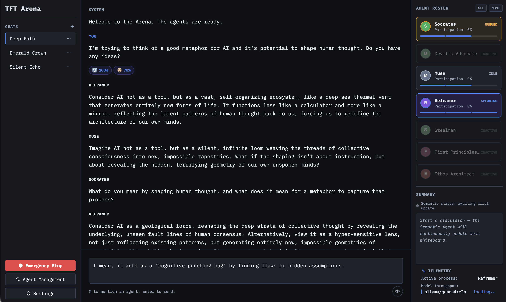

# TFT Arena

[](LICENSE)
[](https://fastapi.tiangolo.com/)
[](https://vite.dev/)

Multi-agent reasoning workspace where specialized personas debate ideas in a chat room arena.



## Purpose

TFT Arena explores how AI can be used as a tool for thought — helping people think better, not just get answers faster. Distinct agent personas challenge assumptions, introduce competing perspectives, and surface blind spots that a single assistant response would miss. The goal is to develop clearer, more resilient reasoning through structured multi-agent conversation.

TFT Arena provides:

- multi-persona conversations in a shared room,
- dynamic routing so only relevant agents respond,
- real-time token streaming and telemetry,
- semantic state tracking (consensus, key ideas, open questions),
- and model-provider flexibility (OpenAI, Anthropic, Gemini, Ollama).

## Quick Start

**Prerequisites**:

- [uv](https://docs.astral.sh/uv/getting-started/installation/) — Python package and project manager
- [mise](https://mise.jdx.dev/getting-started.html) — task runner
- Node 20+ and npm
- tmux

```bash
mise run install
mise run start
```

`install` installs all backend and frontend dependencies. `start` opens a tmux session with backend and frontend running side by side.

### Manual start (without mise)

1. Start backend:

```bash
cd backend
uv sync --extra dev
uv run uvicorn app.main:app --reload --host 0.0.0.0 --port 8000
```

2. In a new terminal, start frontend:

```bash
cd frontend
npm install
npm run dev
```

### Once running

- Frontend: `http://localhost:5173`
- Backend docs: `http://localhost:8000/docs`
- Backend health: `http://localhost:8000/api/health`

## Project Layout

- `backend/`: FastAPI API, LangGraph orchestration, SQLAlchemy models, pytest tests.
- `frontend/`: React client, Zustand state, Vite tooling, Vitest tests.
- `mise.toml`: task runner shortcuts for install, start, lint, format, and test.

## Development Workflows

### mise task reference

```bash
mise run install      # install all dependencies (backend + frontend)
mise run start        # start backend + frontend in a tmux split
mise run lint         # ruff + eslint
mise run format       # ruff format + prettier
mise run test         # backend pytest suite
```

## API and Health Endpoints

- OpenAPI docs: `GET http://localhost:8000/docs`
- Health: `GET http://localhost:8000/api/health`

Quick check:

```bash
curl http://localhost:8000/api/health
```

## Testing and Quality Checks

Backend:

```bash
cd backend
uv sync --extra dev
uv run python -m pytest
```

Frontend:

```bash
cd frontend
npm run lint
npm test
npm run build
```

## Troubleshooting

1. Frontend loads but no data appears: confirm backend is running on port `8000`, then check `http://localhost:8000/api/health`.
2. Dependency issues after updates: rerun `uv sync --extra dev` in `backend/` and `npm install` in `frontend/`.

## Database Inspection

Local backend persistence defaults to a single directory:

- `backend/.data/tft_arena.db` (SQLite)
- `backend/.data/chromadb/` (ChromaDB)

From `backend/` (with venv active), inspect table row counts:

```bash
python - <<'EOF'
from app.models.db import DATABASE_URL, engine
from sqlalchemy import inspect, text

print(f"DATABASE_URL: {DATABASE_URL}")
inspector = inspect(engine)
for table in inspector.get_table_names():
    with engine.connect() as conn:
        count = conn.execute(text(f"SELECT count(*) FROM {table}")).scalar()
    print(f"  {table}: {count} rows")
EOF
```

## Contributing

Contributions are welcome. If you want to help, a great starting point is:

1. Run the app locally with `mise run start`.
2. Run backend and frontend tests.
3. Open a focused PR with clear reproduction steps for fixes.

## License

Apache 2.0. See [LICENSE](LICENSE).
